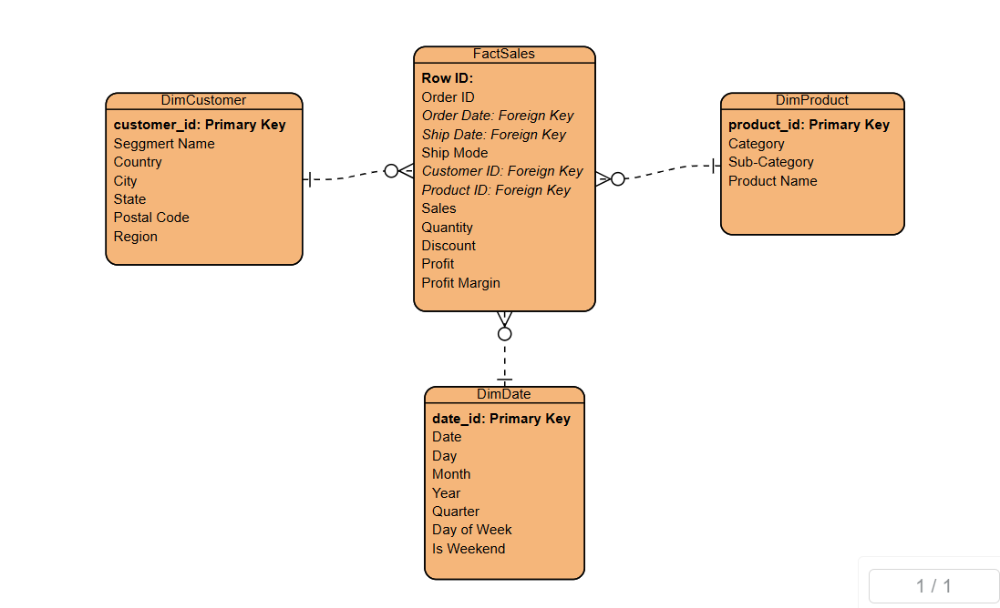

# Retail Sales Data Pipeline and Dashboard

A comprehensive data engineering project that implements a complete ETL pipeline for retail sales data,

## Project Overview

This project demonstrates industry-level data engineering practices by creating a full data pipeline:

1. **Data Ingestion**: Automated extraction from CSV sources with scheduling
2. **Data Cleaning & Transformation**: Advanced cleaning and transformation using pandas
3. **Data Loading**: Structured loading into PostgreSQL with proper error handling
4. **Data Modeling**: Star schema implementation with fact and dimension tables


## Project Structure

```
retail-sales-pipeline/
├── config/                # Configuration files
│   └── database.py        # Database connection setup
├── data/                  # Data directories
│   ├── raw/               # Raw CSV data files
│   └── processed/         # Processed data files
├── etl/                   # ETL components
│   ├── ingestion.py       # Data extraction module
│   ├── transformation.py  # Data cleaning and transformation
│   └── loading.py         # Database loading module
├── models/                # Database models
│   └── schema.py          # SQLAlchemy ORM models
├── analytics/             # Analytics modules
│   └── queries.py         # SQL queries for KPIs
├── scripts/               # Helper scripts
│   └── pipeline.py        # Main pipeline orchestration
├── logs/                  # Log files
├── .env                   # Environment variables (create from .env.example)
├── .env.example           # Example environment variables
├── requirements.txt       # Python dependencies
└── README.md              # Project documentation
```

## Setup Instructions

### Prerequisites

- Python 3.8+
- PostgreSQL database

### Installation

1. Clone the repository
2. Install dependencies:
   ```
   pip install -r requirements.txt
   ```
3. Create a PostgreSQL database for the project
4. Copy `.env.example` to `.env` and update the configuration
5. Ensure your sample data is placed in the `data/raw/` directory

### Running the Pipeline

Run the complete ETL pipeline:

```
python scripts/pipeline.py
```

This will:
- Ingest data from the configured source
- Clean and transform the data
- Load the data into the PostgreSQL database
- Schedule regular runs based on the configured interval

## Data Schema

The project uses a star schema with the following structure:

- **Fact Tables**:
  - `fact_sales`: Sales transactions with metrics

- **Dimension Tables**:
  - `dim_customer`: Customer information
  - `dim_product`: Product catalog
  - `dim_date`: Date dimension for time-based analysis

## data modelling images


## Skills Demonstrated

This project demonstrates the following data engineering skills:

- ETL pipeline development
- Data modeling and schema design
- SQL database implementation
- Data cleaning and transformation
- Scheduling and automation
- Error handling and logging
- Environment configuration

## Future Enhancements

Potential areas for expansion:

- Add data quality validation checks
- Add interactive dashboard
- Implement incremental loading
- Add more advanced analytics (forecasting, etc.)
- Set up CI/CD pipeline for deployment
- Containerize with Docker

